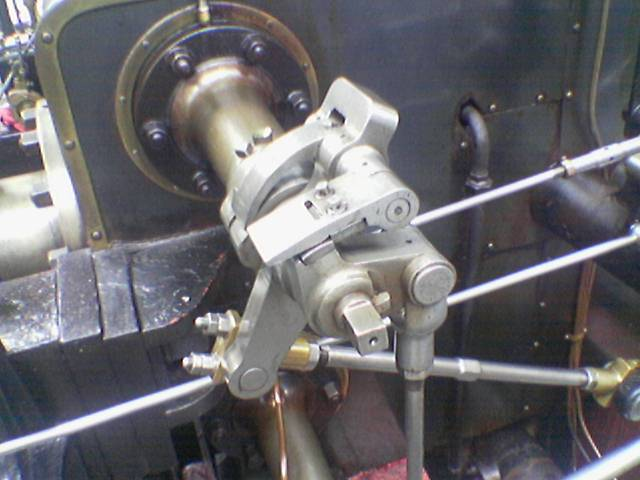

# Convolution
Just a python script implementing an algorithm to apply the [Sobel](https://en.wikipedia.org/wiki/Sobel_operator) operator in an image.
Not the _fastest_ algorithm, just the **easiest**.

## How to use
``` console
git clone https://github.com/hott-henrique/Convolution.git
cd Convolution
pip install -r requirements.txt
python3 main.py --image-input assets/dog.jpg --image-output assets/s-dog.jpg
```

## Examples




